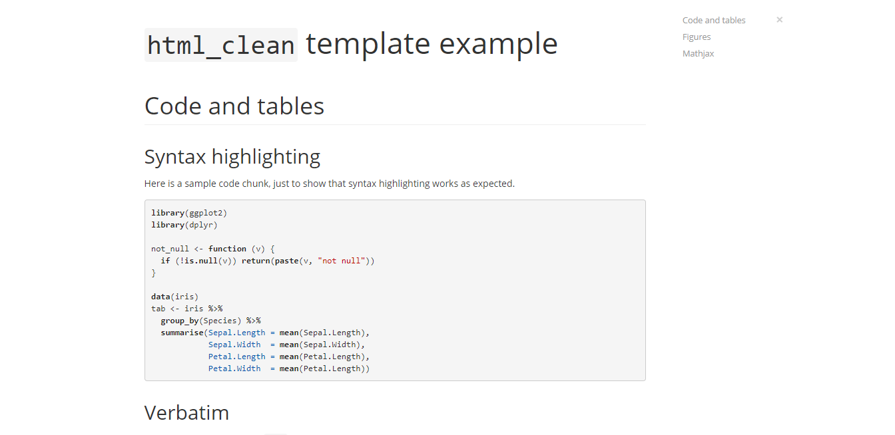

<style>
  .col2 {
    columns: 2 200px;         /* number of columns and width in pixels*/
    -webkit-columns: 2 200px; /* chrome, safari */
    -moz-columns: 2 200px;    /* firefox */
  }
  .col3 {
    columns: 3 100px;
    -webkit-columns: 3 100px;
    -moz-columns: 3 100px;
  }
</style>

# Tabela de conteúdos

Para inserir uma tabela de conteúdos (*table of contentes*), basta inserir no YAML: `toc: true`. Com isso um índice será inserido no documento. Podemos também incluir apenas títulos de nível maior ou igual a $k$. Veja o seguinte exemplo:

```
# Título nível 1

## Título nível 2

### Título nível 3
```

Suponha que no índice só devam aparecer títulos de nível até 
2. Para isso utilizamos `toc_depth: 2` no cabeçalho. Lembre-se que o nível do título é definido pela quatidade de `#`.

# Numeração de títulos

Podemos numerar os títulos facilmente, quando o outpt é um documento pdf ou html, adicionando `number_sections: true` no YAML. Com isso, todos os títulos serão numerados. Já ao escolher um documento de word como output, é necessário criar um arquivo de referência. Veja [este tutorial](word_referencia.html) para aprender a criar um arquivo de referência.

Para que um título específico não seja numerado, mesmo definindo `number_sections: true`, basta adicionar `{-}` ao lado do nome do título:

```
## Título que será numerado

## Título que não será numerado {-}
```

# Instalação de pacotes

Caso seja necessário executar a instalação de pacotes num arquivo .Rmd é necessário fornecer o repositório através do argumento `repos`. Caso contrário a execução será interrompida por um erro. Um possível repositório a ser utilizado é o da Fiocruz. O comando deve ficar dessa maneira:

```{r eval = F}
install.packages("DT", repos = "https://cran.fiocruz.br/")
```


# Helps

Para consultar possíveis argumentos colocados no YAML, basta verificar o help das funções do pacote `rmarkdown` de mesmo nome do `output`. Por exemplo, se `output: html_document`, devemos ver o help da função `html_document`, do pacote `rmarkdown`. 

# Abas {#abas}

Para inserir abas em um documento html, basta inserir, ao lado de um título: `{.tabset}`. Em seguida inserimos subtítulos, que se tornarão abas. O conteúdo abaixo de cada subtítulo será associado à respectiva guia. Para fechar a divisão em abas inserimos um título de nível igual ao que abriu as abas.

```
## Seção {.tabset}

### Primeira aba

Conteúdo da primeira aba

### Segunda aba

Conteúdo da segunda aba

## Próxima seção

Conteúdo após a divisão em abas
```

Caso estejamos com `number_sections: true` e não queiramos criar uma próxima seção, basta inserir `## {-}`

# Templates (html)

Existem pacotes que fornecem templates para os relatórios em html diferentes do template básico, como é o caso deste relatório. Para isso basta instalar o pacote no R e, ao criar um novo R Markdown, clicamos em *From template* e selecionamos o template do pacote desejado. Citamos dois pacotes:

- [`prettydoc`](http://yixuan.cos.name/prettydoc/)
- [`rmdformats`](https://github.com/juba/rmdformats)

Em geral esses pacotes permitem as mesmas formatações de qualquer relatório em html. No entanto, algumas funcionalidades podem não funcionar ao utilizá-los. Por exemplo, no `prettydoc` não é possível inserir abas como mostrado [aqui](#abas). É importante estar atentos ao repositório desses pacotes no GitHub para relatar e verificar a existência de problemas na utilização dos pacotes.

Veja exemplos de relatórios utilizando estes pacotes:

<div class="col2">
[](http://yixuan.cos.name/prettydoc/architect.html)
[](http://yixuan.cos.name/prettydoc/cayman.html)
</div>

<div class="col2">
[](http://yixuan.cos.name/prettydoc/hpstr.html)
[](http://yixuan.cos.name/prettydoc/leonids.html)
</div>

<div class="col2">
[](http://yixuan.cos.name/prettydoc/tactile.html)
[](https://cdn.rawgit.com/juba/rmdformats/master/resources/examples/material/material.html)
</div>

<div class="col2">
[](https://cdn.rawgit.com/juba/rmdformats/master/resources/examples/readthedown/readthedown.html)
[](https://cdn.rawgit.com/juba/rmdformats/master/resources/examples/html_clean/html_clean_sample.html)
</div>

<center>
<div class="col2">
[](https://cdn.rawgit.com/juba/rmdformats/master/resources/examples/html_docco/html_docco_sample.html)
</div>
</center>

