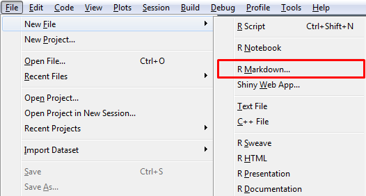
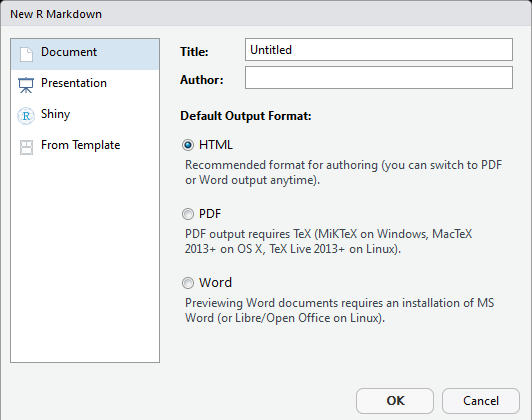

---
title: "Introdução ao R Markdown"
author: "Leonardo Filgueira e Matheus Camelo"
date: "17/10/2018"
output:
  prettydoc::html_pretty:
    theme: cayman
    highlight: github
--- 

R Markdown é, basicamente, uma combinação entre códigos do R e texto em *Markdown*.

## O que é *Markdown*?

Segundo seu próprio criador:

> Markdown é uma ferramenta de conversão de texto para HTML para escritores da web. Ele permite uma escrita fácil de ler, fácil de escrever, num formato de texto plano, e então converte este texto para HTML. (Markdown is a text-to-HTML conversion tool for web writers. Markdown allows you to write using an easy-to-read, easy-to-write plain text format, then convert it to structurally valid XHTML (or HTML)).

- *Markdown* é uma *linguagem de marcação*.

- Uma *linguagem de marcação* "possui uma forma de descrever a estrutura lógica ou semântica de um documento e fornecer instruções a computadores sobre como apresentar o conteúdo de um arquivo".

- Possui formatação simples, com o objetivo de não gastar muito tempo na formatação, e sim na escrita do texto.

## Vantagens e aplicações

- Pode ser utilizado facilmente para produzir um relatório, num trabalho de uma disciplina ou no mercado de trabalho;

- Produz documentos dinâmicos. Caso seja modificado o código do R, ou algum resultado do código, o resultado será atualizado ao compilar o arquivo. Não é necessário fazer as alterações manualmente;

- Reproducibilidade. Este arquivo, por exemplo, pode ser reproduzido, desde que o computador possua o R com os pacotes devidamente instalados.

- Variedade de formatos de *output*, sejam formatos estáticos ou dinâmicos, desde um documento de word até um HTML interativo.

- Uso de algumas estruturas do $\LaTeX{}$.

## Criando um arquivo .Rmd

- No RStudio, basta clicar em *File*, *New File*, *R Markdown*:

    

- Uma janela se abrirá, onde poderemos inserir título, autor e formato de *output*:

    