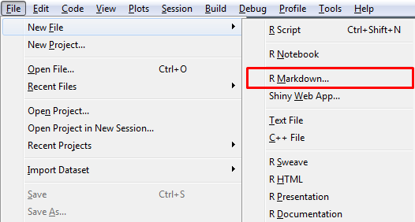
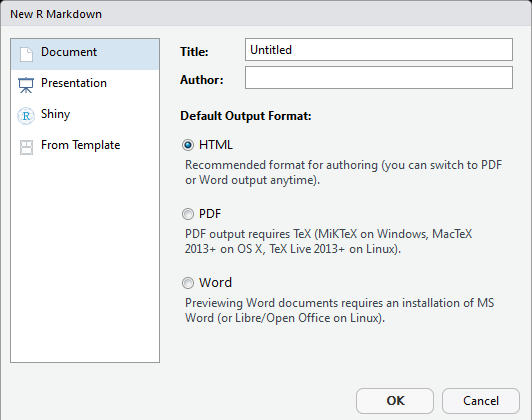
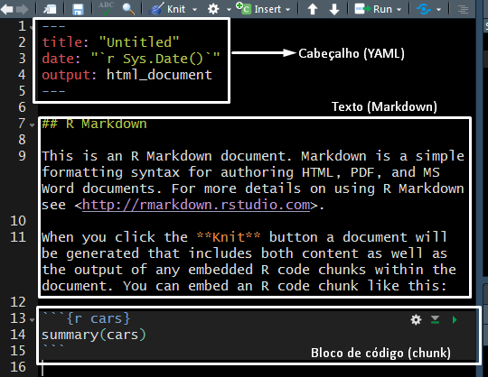
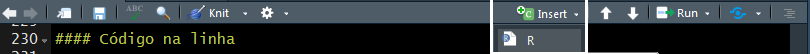

---
title: "Relatórios dinâmicos com o R Markdown"
author: "Leonardo Filgueira e Matheus Camelo"
date: "17/10/2018"
output: 
  prettydoc::html_pretty:
    theme: cayman
    highlight: github
    includes:
      in_header: imagem.html
--- 

&nbsp;

&nbsp;

R Markdown é, basicamente, uma combinação entre códigos do R e texto em *Markdown*.

# O que é *Markdown*?

Segundo seu próprio criador:

> Markdown é uma ferramenta de conversão de texto para HTML para escritores da web. Ele permite uma escrita fácil de ler, fácil de escrever, num formato de texto plano, e então converte este texto para HTML. (Markdown is a text-to-HTML conversion tool for web writers. Markdown allows you to write using an easy-to-read, easy-to-write plain text format, then convert it to structurally valid XHTML (or HTML)).

&nbsp;

- *Markdown* é uma *linguagem de marcação*.

- Uma *linguagem de marcação* "possui uma forma de descrever a estrutura lógica ou semântica de um documento e fornecer instruções a computadores sobre como apresentar o conteúdo de um arquivo".

- Possui formatação simples, com o objetivo de não gastar muito tempo na formatação, e sim na escrita do texto.

&nbsp;

# Vantagens e aplicações

- Pode ser utilizado facilmente para produzir um relatório, num trabalho de uma disciplina ou no mercado de trabalho;

- Produz documentos dinâmicos. Caso seja modificado o código do R, ou algum resultado do código, o resultado será atualizado ao compilar o arquivo. Não é necessário fazer as alterações manualmente;

- Reprodutibilidade. Este arquivo, por exemplo, pode ser reproduzido desde que o computador possua o R com os pacotes devidamente instalados.

- Variedade de formatos de *output*, sejam formatos estáticos ou dinâmicos, desde um documento de word até um HTML.

- Uso de algumas estruturas do $\LaTeX{}$.

&nbsp;

# Pacotes necessários

Para criar um documento dinâmico no R Markdown são necessários os seguintes pacotes:

- [`rmarkdown`](https://rmarkdown.rstudio.com/)
- [`knitr`](https://yihui.name/knitr/)

Também é preciso ter o **pandoc** instalado, que é o programa que faz a conversão do texto *markdown*. Ao utilizar o RStudio não é necessário instalá-lo, mas para checar se ele está instalado, basta executar `rmarkdown::pandoc_available()`. Para verificar qual versão do pandoc está instalada no sistema, usamos `rmarkdown::pandoc_version()`. Caso seja necessário podemos baixar o pandoc [nesta página](https://github.com/jgm/pandoc/releases).

Além disso ao criar relatórios interativos, pode ser necessário o pacote [`shiny`](https://shiny.rstudio.com/).

&nbsp;

# Criando um arquivo .Rmd

- No RStudio, basta clicar em *File* > *New File* > *R Markdown*:

    

- Uma janela se abrirá, onde poderemos inserir título, autor e formato de *output*:

    
    
- Ao apertar em "OK" o arquivo .Rmd será aberto.

- Para compilar o arquivo, aperte no botão **Knit**, ou pressione *Ctrl + Shift + K*. Veja o resultado.

- Vejamos a estrutura básica de um arquivo .Rmd:

    
    
&nbsp;

## Formatação do texto

A seguir serão apresentadas algumas maneiras de aplicar formatações ao texto. Para mais detalhes, veja o [guia de referência do rmarkdown](https://www.rstudio.com/wp-content/uploads/2015/03/rmarkdown-reference.pdf) e o [rmarkdown cheatsheet](https://www.rstudio.com/wp-content/uploads/2016/03/rmarkdown-cheatsheet-2.0.pdf). 

<!-- https://github.com/mustafaascha/rmarkdownTutorial -->

&nbsp;

### Seções e subseções

Ao adicionar \# no início de uma linha, o texto nessa linha será transformado em seção, se colocarmos \#\#, teremos uma subseção, e por aí vai...

<center>
```
# Seção de nível 1

## Seção de nível 2

### Seção de nível 3

#### Seção de nível 4
```
</center>

&nbsp;

### Itálico & Negrito

Se quisermos que um trecho do texto seja formatado em _itálico_, usamos \* ou \_ entre o trecho. E para colocar em **negrito** usamos \*\* ou \_\_:

<center>
```
*Este texto ficará em itálico*,     _assim como este aqui._

**Este texto ficará em negrito**,    __assim como este aqui.__

***Este texto ficará em italíco e negrito***,    ___assim como este aqui.___
```
</center>

Além disso, usamos \~\~ para o trecho ficar ~~riscado~~.

&nbsp;

### Parágrafo

Basta pular uma linha e teremos dois parágrafos.

```
Este é o texto do primeiro parágrafo.

Este é o texto do segundo parágrafo. Note a linha em branco entre eles.
```

Caso queira aumentar o espaço entre os dois parágrafos use entre eles o comando `&nbsp;`.

&nbsp;

### Listas

#### Não ordenadas

Para fazer listas de tópicos, basta pular uma linha do resto do texto, utilizar \-, \*, ou \+ e escrever o texto, após um espaço. Sub listas devem ser escritas pelo menos dois espaços após o início do nível anterior.

```
Bloco de texto que vem antes da lista. 

- Primeiro item da lista.
  + Sub lista do primeiro item
  + Outro elemento da sub lista
- Segundo item da lista.
  + Sub lista do segundo item.
    * Lista da sub lista do segundo item
- Terceiro item da lista.
```
Resultando em:

- Primeiro item da lista.
  + Sub lista do primeiro item
  + Outro elemento da sub lista
- Segundo item da lista.
  + Sub lista do segundo item.
    * Lista da sub lista do segundo item
- Terceiro item da lista.


#### Ordenadas

Para que a lista seja ordenada, basta utilizar um número com um ponto a seguir:

```
1. Item 1
    + Item a.
    + Item b.
    + Item c.
2. Item 2
3. Item 3
```
Resultando em:

1. Item 1
    + Item a.
    + Item b.
    + Item c.
2. Item 2
3. Item 3


O primeiro número inserido será usado na lista. Os outros seguirão a sequência, não importanto o número inserido. A lista a seguir produzirá o mesmo resultado que a lista anterior:

```
1. Item 1
    + Item a.
    + Item b.
    + Item c.
10. Item 2
5. Item 3
```

Também é possível criar as listas ordenadas com \#\.

```
#. Item 1
#. Item 2
#. Item 3
```

&nbsp;

### Links

O link pode ser simplesmente colado no texto, ou então pode ser inserido da seguinte maneira:

<center>
```
[Trecho que aparecerá no texto como link](link)
```
</center>

&nbsp;

### Imagens

Uma das maneiras de inserir imagens no R Markdown é bem parecida com a maneira de inserir link:

<center>
```
Vindas do seu computador:


Vindas da web:

```
</center>

O caminho para a imagem deve ser colocado sem aspas. Caso a imagem esteja na mesma pasta do arquivo .Rmd, então será necessário apenas escrever o nome da imagem. Para controlar a largura da imagem use `width`, cujo default é `{width=100%}`.

&nbsp;

### Citações

Para fazer alguma citação basta utilizar \> no início da linha (o texto será quebrado automaticamente):

```
> Sabe sim! Sabe sim! Nós estamos falando aqui de um plano, que chama-se Nova ordem mundial: União de toda a América do Sul, conexão de toda a América do Sul, fazendo apenas, tirando todas as fronteiras, fazendo uma única nação, pátria grande. Poucos ouviram falar disso e vai ser pouco divulgado, isso. Eles sabem do que nós estamos falando. Quero deixar bem claro que no nosso governo o comunismo não vai ter vez. Deixar muito claro isso!
>
> `r ''` r tufte::quote_footer('--- Cabo Daciolo')
```

> Sabe sim! Sabe sim! Nós estamos falando aqui de um plano, que chama-se Nova ordem mundial: União de toda a América do Sul, conexão de toda a América do Sul, fazendo apenas, tirando todas as fronteiras, fazendo uma única nação, pátria grande. Poucos ouviram falar disso e vai ser pouco divulgado, isso. Eles sabem do que nós estamos falando. Quero deixar bem claro que no nosso governo o comunismo não vai ter vez. Deixar muito claro isso!
>
> `r tufte::quote_footer('--- Cabo Daciolo')`


Note que para inserir o autor da frase estamos usando uma função do R. Para funcionar é necessário ter o pacote `tufte` instalado.

&nbsp;

### Expressões matemáticas

#### Na linha

Qualquer texto que for inserido entre \$ será tratado como equação que será inserida na frase onde for escrita. Esses comandos são os mesmos utilizados no $\LaTeX{}$: 

```
Sabemos que $2^2 + 6 = 10$ e também que $\sqrt{4}^2 = 4$.
```
Sabemos que $2^2 + 6 = 10$ e também que $\sqrt{4} = 2$.


#### Em um bloco

Para que a expressão matemática seja inserida em um bloco separado do texto, utilizamos \$\$ entre a expressão.

```
Se $X$ tem distribuição normal, então sua função de densidade é dada por:

$$ f_X(x) = \frac{1}{\sqrt{2 \pi \sigma}} \exp \left \{\frac{-(x - \mu)^2}{2\sigma^2} \right \}$$
```
Se $X$ tem distribuição normal, então sua função de densidade é dada por:

$$ f_X(x) = \frac{1}{\sqrt{2 \pi \sigma}} \exp \left \{\frac{-(x - \mu)^2}{2\sigma^2} \right \}
 $$


&nbsp;

### Tabelas

Usamos \| para separar colunas e \- para delimitar o cabeçalho da tabela:

<center>
```
Primeira coluna  | Segunda coluna
---------------- | --------------
Conteúdo         | Conteúdo
Conteúdo         | Conteúdo
```
</center>

Primeira coluna  | Segunda coluna
---------------- | --------------
Conteúdo         | Conteúdo
Conteúdo         | Conteúdo

&nbsp;

## Código

### Código na linha

Basicamente quando queremos escrever código iremos utilizar crase (\`). Se desejamos inserir um resultado de um código do R na linha, junto da frase faremos da seguinte forma:

```{r eval = F}
Sabemos que a base do R iris possui `r nrow(iris)` observações.
```

Se desejarmos que uma palavra (ou trecho) tenha a aparência de código mas não seja executado, basta omitir a letra 'r'.

```{r eval = F}
Para descobrir o número de linhas de um data.frame utilizamos a função `nrow`
```

&nbsp;

### Bloco de código (chunk)

Para inserir um bloco de códigos, clique no botão "Insert" e selecione "R"



Dessa maneira será inserido, onde o cursor estiver localizado, o seguinte:


`r ''` ```{r}

`r ''` ```


Neste espaço podemos escrever códigos do R normalmente, como se estivéssemos em um script.

#### Opções do chunk

Opção         | Resultado
--------------| ---------------------------------------------------------- 
`eval = FALSE` | mostra o chunk, mas não o executa;
`echo = FALSE` | executa o chunk, mas não o mostra;
`warning = FALSE` | não mostra mensagens de erros;
`message = FALSE` | não mostra mensagens de carregamento de funções;
`fig.align`, `fig.height`, `fig.width` | mexe no alinhamento, altura e largura da imagem/figura. Veja mais opções [aqui](https://sebastiansauer.github.io/figure_sizing_knitr/).
`cache = TRUE` | armazena o output do chunk em pastas separadas. Evita que a geração do relatório demore. É recomendado nomear o chunk `{r nome_chunk}`

Exemplo:


```{r, echo = FALSE}
library(datasets)
data("iris")
```

```{r, eval = FALSE}
summary(iris)
```

&nbsp;

#### Instalação de pacotes

Caso seja necessário executar a instalação de pacotes num arquivo .Rmd é necessário fornecer o repositório através do argumento `repos`. Caso contrário a execução será interrompida por um erro. Um possível repositório a ser utilizado é o da Fiocruz. O comando deve ficar dessa maneira:

```{r eval = F}
install.packages("DT", repos = "https://cran.fiocruz.br/")
```

&nbsp;

&nbsp;

## Exercício prático

Crie um relatório em HTML conforme o seguinte [modelo](../Exercício/exercicio_pratico.html).

&nbsp;

&nbsp;

## Ver também:

- [Manual do Pandoc](https://pandoc.org/MANUAL.html)
- [Guia definitivo do R Markdown](https://bookdown.org/yihui/rmarkdown/)
- [Markdown Basics ](https://rmarkdown.rstudio.com/authoring_basics.html), do site do RStudio.
- http://cursos.leg.ufpr.br/prr/capLitProg.html
- https://rstudio-pubs-static.s3.amazonaws.com/46674_35d398934e474467aa3655546d1531b0.html#25


