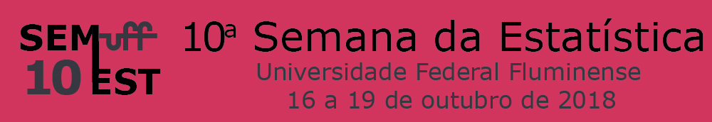

&nbsp;

# 10ª Semana da Estatística da UFF

É um evento anual que acontece durante a agenda acadêmica da Universidade. Para mais informações consulte o [site](http://www.semest.uff.br/).



&nbsp;

## Minicursos da SEMEST

A 10ª edição da semest conta com 8 minicursos, um deles é sobre o R markdown. Nele, serão abordados alguns itens sobre formatação de texto, como por exemplo:

- Seções e subseções
- *Ítalico* e **Negrito**
- Listas
    - Ordenadas
    - Não ordenadas
- Expressões matemáticas na linha como $5 + 5 = 10$ e em bloco:

$$5+5=10$$

Além disso, será visto como inserir códigos em R através de chunk a partir da base de dados `iris`.

```{r}
library(datasets)
data("iris")
head(iris, n = 3)
```

Sabe-se que este data frame possui `r nrow(iris)` observações e `r ncol(iris)` colunas e seus dados podem ser resumidos como:

```{r, echo = FALSE}
summary(iris)
```


