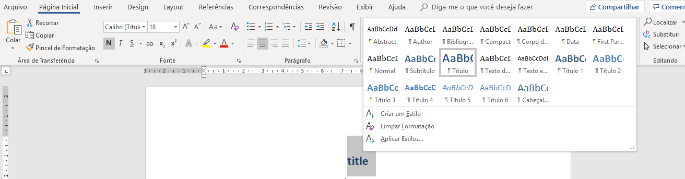
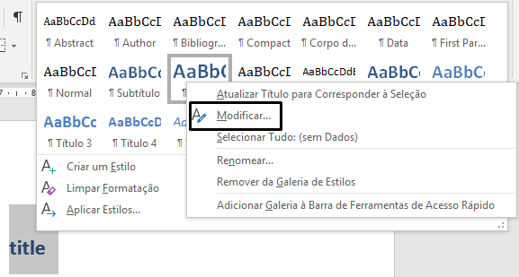
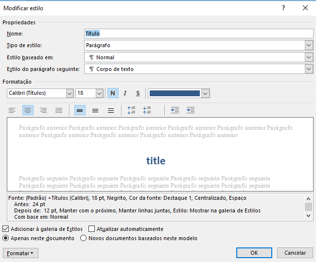

A formatação do documento gerado em word pode ser modificada normalmente no editor de texto, mas se desejarmos que todos os documentos de word tenham uma mesma formatação (diferente da formatação padrão), o Rmarkdown permite que façamos um documento de referência, para que todos os documentos gerados possuam os mesmos estilos da referência.

# Passo a passo

Primeiramente devemos criar um novo Rmarkdown com um documento word como output. Assim um arquivo Rmd é gerado e podemos já executá-lo, gerando um arquivo *.docx*. Assim abriremos esse arquivo no word e editaremos os estilos.

## Edição de estilos

Para editar um estilo, devemos selecionar o texto que contém o estilo a ser selecionado e ir para a seção "Estilos" do word, na Página Inicial. Suponha que desejemos modificar o estilo do título:

<center>

</center>

&nbsp;

Devemos, então, clicar com o botão direito sobre o estilo e ir em "Modificar":

<center>

</center>

&nbsp;

Então uma janela se abrirá, onde poderemos modificar cor, fonte, tamanho, e várias outras formatações do estilo.

<center>

</center>

&nbsp;

<div class="alert alert-danger" role="alert">
  <span class="glyphicon glyphicon-exclamation-sign" aria-hidden="true"></span>
  <span class="sr-only">Error:</span>
  Importante: Não devemos mudar o nome do estilo, adicionar novos os estilos ou trocar o estilo de qualquer parte do texto.
</div>

Após modificar os estilos desejados, iremos salvar o documento na mesma pasta onde faremos nosso Rmarkdown, por exemplo com o nome de *referencia.docx*.

## Apontando arquivo de referência

Ao abrir um novo arquivo de Rmarkdown adicionaremos o parâmetro `reference_docx` ao YAML:

```
title: ""
date: "`r Sys.Date()`"
output:  
  word_document:
    reference_docx: referencia.docx

```

Assim, o relatório gerado terá os estilos com a formatação modificada que foi salva em *referencia.docx*.

# Fonte

Para um melhor entendimento desta questão, recomendamos ler [esse artigo](https://rmarkdown.rstudio.com/articles_docx.html), que apresenta mais detalhadamente o procedimento, além de levantar outros pontos sobre a formatação.